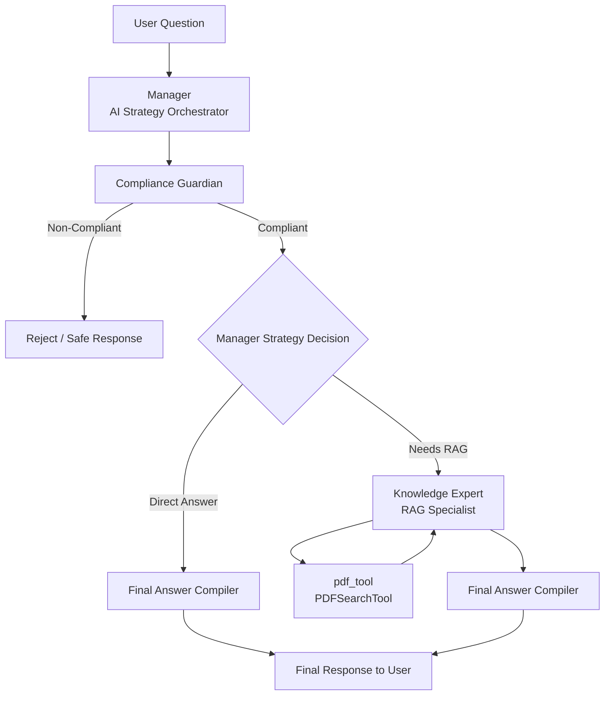

# Desafio Técnico - MultiAgent Platform

Este projeto é uma plataforma de múltiplos agentes desenvolvida como parte de um desafio técnico. Ele utiliza a biblioteca `crewai` para gerenciar agentes e tarefas, permitindo a execução de processos hierárquicos com diferentes agentes especializados.

## Estrutura do Projeto

O projeto está estruturado da seguinte forma:
- **src/corporative_agent/**: Contém o código principal do projeto, incluindo a definição dos agentes, tarefas e o processo de execução.
- **config/**: Contém os arquivos de configuração para os agentes (`agents.yaml`) e tarefas (`tasks.yaml`).
- **knowledge/**: Contém arquivos de conhecimento, como o PDF `condicao_de_acionamento.pdf`, utilizado por um dos agentes.

## Pré-requisitos

Certifique-se de ter o Python 3.12 ou superior instalado em sua máquina.

## Como Rodar o Projeto

1. Clone o repositório para sua máquina local:
   ```bash
   git clone <URL_DO_REPOSITORIO>
   cd corporative_agent
   ```

2. Crie e ative um ambiente virtual:
   - No Windows:
     ```bash
     python -m venv venv
     venv\Scripts\activate
     ```
   - No Linux/Mac:
     ```bash
     python3 -m venv venv
     source venv/bin/activate
     ```

3. Instale as dependências do projeto:
   ```bash
   pip install -r requirements.txt
   ```

4. Configure as variáveis de ambiente:
   - Crie um arquivo `.env` na raiz do projeto seguindo o padrão do arquivo `example.env`.
   - Certifique-se de preencher todas as variáveis necessárias.

5. Execute o projeto utilizando o comando `crewai`:
   ```bash
   crewai run
   ```

## Decisões e Trade-offs

### Arquitetura Hierárquica

Foi adotado o processo hierárquico para separar claramente as responsabilidades entre:

- Compliance

- Retrieval Augmented Generation (RAG)

- Especialistas de resposta

Essa abordagem melhora organização, auditabilidade e facilita evolução futura do sistema.

### Uso de RAG com Chroma + OpenAI Embeddings

Foi utilizado Chroma como vector store por oferecer:

Persistência simples

Facilidade de uso local

Escalabilidade superior a soluções puramente em memória

Utilização do OpenAI Embeddings foi escolhido pela facilidade de desenvolvimento e sem necessidade de infraestrutura própria.

### Prompt Engineering

Prompts foram organizados por agente/tarefa em arquivos YAML conforme sugerido pelo Crew AI, promovendo clareza arquitetural e manutenção simplificada.

Como estratégia de redução de número de tokens foi utilizado a estratégia de Zero Shot e ReAct, com todo o conteúdo na língua inglesa que tende a ter uma média menor de tokens por palavra.

Dessa forma garantimos um índíce baixo de alucinação, mas com uma latência razoável em relação ao escopo do projeto.

### Evolução

Para evoluir o projeto eu usaria o tracing mode do CrewAI com um handler de logs para trazer uma maior observabilidade para o projeto.

Caso o projeto tivesse maior necessidade de interação com o usuário, poderia ser implementado uma interface usando Streamlit e separando os papeis de backend e frontend.

Poderia ser transformado a aplicação em um worker e ser chamado de forma async pelo backend conforme necessário, trazendo maior escalabilidade.