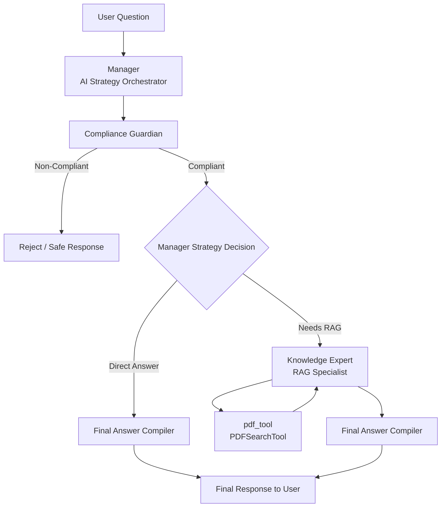

# Desafio Técnico - MultiAgent Platform

Este projeto é uma plataforma de múltiplos agentes desenvolvida como parte de um desafio técnico. Ele utiliza a biblioteca `crewai` para gerenciar agentes e tarefas, permitindo a execução de processos hierárquicos com diferentes agentes especializados.

## Estrutura do Projeto

O projeto está estruturado da seguinte forma:
- **src/corporative_agent/**: Contém o código principal do projeto, incluindo a definição dos agentes, tarefas e o processo de execução.
- **config/**: Contém os arquivos de configuração para os agentes (`agents.yaml`) e tarefas (`tasks.yaml`).
- **knowledge/**: Contém arquivos de conhecimento, como o PDF `condicao_de_acionamento.pdf`, utilizado por um dos agentes.

## Pré-requisitos

Certifique-se de ter o Python 3.8 ou superior instalado em sua máquina.

## Como Rodar o Projeto

1. Clone o repositório para sua máquina local:
   ```bash
   git clone <URL_DO_REPOSITORIO>
   cd corporative_agent
   ```

2. Crie e ative um ambiente virtual:
   - No Windows:
     ```bash
     python -m venv venv
     venv\Scripts\activate
     ```
   - No Linux/Mac:
     ```bash
     python3 -m venv venv
     source venv/bin/activate
     ```

3. Instale as dependências do projeto:
   ```bash
   pip install -r requirements.txt
   ```

4. Execute o projeto utilizando o comando `crewai`:
   ```bash
   crewai run
   ```

## Arquitetura do Projeto

### Arquitetura Hierárquica (Multi-Agente)

Foi adotado o processo hierárquico para separar claramente as responsabilidades entre:

Compliance

Retrieval Augmented Generation (RAG)

Especialistas de resposta

Essa abordagem melhora organização, auditabilidade e facilita evolução futura do sistema.
